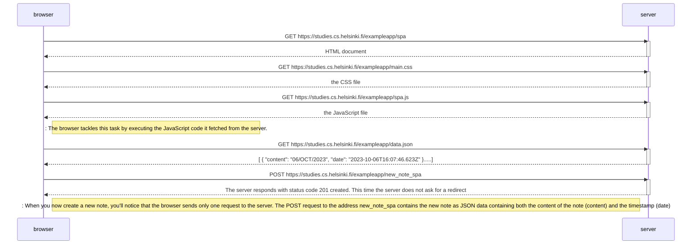

```mermaid

sequenceDiagram
    participant browser
    participant server

    browser->>server: GET https://studies.cs.helsinki.fi/exampleapp/spa
    activate server
    server-->>browser: HTML document 
    deactivate server

    browser->>server: GET https://studies.cs.helsinki.fi/exampleapp/main.css
    activate server
    server-->>browser: the CSS file
    deactivate server

    browser->>server: GET https://studies.cs.helsinki.fi/exampleapp/spa.js
    activate server
    server-->>browser: the JavaScript file
    deactivate server

    Note right of browser:: The browser tackles this task by executing the JavaScript code it fetched from the server.

    browser->>server: GET https://studies.cs.helsinki.fi/exampleapp/data.json
    activate server
    server-->>browser: [ { "content": "06/OCT/2023", "date": "2023-10-06T16:07:46.623Z" }.....]
    deactivate server

    browser->>server: POST https://studies.cs.helsinki.fi/exampleapp/new_note_spa
    activate server
    server-->>browser: The server responds with status code 201 created. This time the server does not ask for a redirect
    deactivate server

    Note right of browser:: When you now create a new note, you'll notice that the browser sends only one request to the server. The POST request to the address new_note_spa contains the new note as JSON data containing both the content of the note (content) and the timestamp (date)


```
